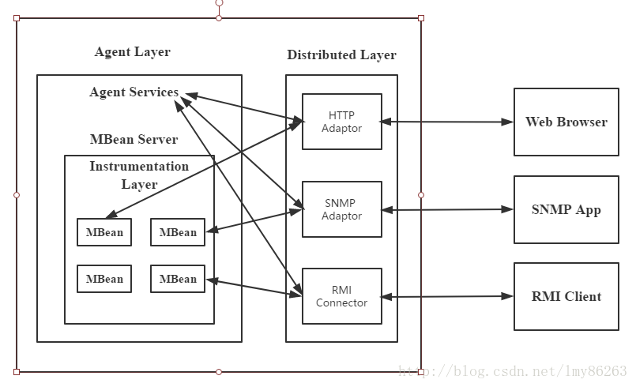

## jmx简介  

## 应用场景  
+ 管理应用程序配置项，可以在运行期间动态改变配置项的值，而不用妨碍程序的运行。
+ 对应用程序的运行状态进行监控，例如对一个大型交易管理系统，监控当前多少交易正在排队中，每笔交易的处理时间是多少，平均每处理一笔交易要花多长时间。
## jmx中的术语  
+ 管理资源（Manageable resource）：像我在上面说的，只要是能帮助是你的活动和系统正常运转的都算资源，可以是硬件、也可以是应用，只要能够被Java的类描述即可；  
+ 管理组件（MBean，managed bean）：从资源的角度来看，它是一个对抽象的资源的一个描述，比如说如果资源是数据库，管理组件中可以提供数据库的一些描述信息，比如数据库服务器的运行地址、端口，类型以及最大连接数等等，但是这个类必须满足JMX规范中的提出的要求，比如命名规则和实现标准，类似于JavaBean。由于管理组件是资源的抽象，所以管理应用是直接面向MBean，也就说MBean会被暴露给管理应用来操作和访问，通过MBean中提供的属性和方法，MBean也有几种类型，为了不添堵，如果没有特殊说明，本文指的都是Standard MBean，关于它的具体使用在下面的编码部分说明；
+ 管理组件服务器（MBean Server）：简单的来看，它是一个容器，用来盛装和管理一组MBeans，它是整个JMX管理环境的核心，由于其中有很多的MBean，所以它必须提供一种机制来区分各个MBean，这就是注册机制，每个添加到MBean Server的MBean在注册的时候都要提供一个ObjectName来区分彼此，MBean Server 通过这个ObjectName来查找每个MBean，在JMX中是通过ObjectName类来为每个MBean提供唯一的一个标识，它包括两部分:
 1. 域名：这个域名通常是和想要注册到的MBean Server的名称标识相同，以便根据功能模块区分不同MBean Server中的MBean；  
 2. 键值对列表：被用来唯一的标识MBean，也提供了关于该MBean的信息，形式如下：HelloAgent:name=helloWorld；其中的属性不一定是真实的MBean的属性，仅仅要求当和其他的MBean比较的时候能够唯一标识，每个ObjectName中都要至少有一个属性； 
+ JMX代理（JMX Agent）：它提供一系列的服务来管理一系列的MBeans，它是MBean Server的容器。JMX代理提供一些服务，包括创建MBean之间的关系，动态加载类，简单监视服务，以及计时器；代理可以有一系列的协议适配器（Protocol adapters ）和连接器（connectors ），协议适配器和连接器也是Java类，通常情况下也是MBeans，这些适配器和连接器是提供转接功能而存在的，以便可以在远程使用不同的协议，通过客户端与这个代理连接，它内部可以映射到一个外部的协议或者暴露代理给远程连接，这就意味着JMX代理可以被一系列不同的管理协议和工具使用，在本质上是插件式架构的一种体现，体现了可插拔的思想；
+ 协议适配器和连接器（Protocol adapters and connectors ）：协议适配器和连接器是JMX Agent中的对象，将代理暴露给不同的管理应用和协议，这个和不同的数据库的驱动程序类似，每个数据库都有自己的一套协议来联系，为了保持进行连接，就需要在JDBC应用和数据库服务器之间通过不同的驱动程序关联。一个JMX Agent可以有任意数量的适配器和连接器；它们也是MBeans；
+ 通知（Notification ）：通知是由MBeans和MBean Server 提出的，其中封装了具体的事件和相应的数据。其他的MBeans或者Java对象可以注册作为监听器来接收这些通知，其实就是观察者设计模式在JMX中的应用；  
## jmx架构  
**jmx架构是组件式的，被设计为三层**
+ 分布层（Distributed layer）：包含可以使管理应用与JMX Agents交互的组件。一旦通过交互组件与JMX Agents建立连接，用户可以用管理工具来和注册在Agents中的MBeans进行交互；
+ 代理层（Agent layer ）：包含JMX Agent以及它们包含的MBean Servers。Agent layer的主要组件是MBean server，作为JMX Agents的核心，它充当MBeans的注册中心。该层提供了4个Agent 服务来使对MBean的管理更容易：计时器（Timer）、监控（monitoring）、动态加载MBean（dynamic MBean loading ）、关系服务（relationship services ）；
+ 指示层（Instrumentation layer ）：包含代表可管理资源的MBeans。该层是最接近管理资源的，它由注册在Agents中的MBeans组成，这个MBean允许通过JMX Agent来管理。每个MBean都暴露出来针对底层资源的操作和访问；
   
 

[jmx超详细解读](https://www.cnblogs.com/dongguacai/p/5900507.html)  